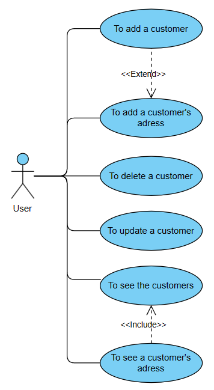
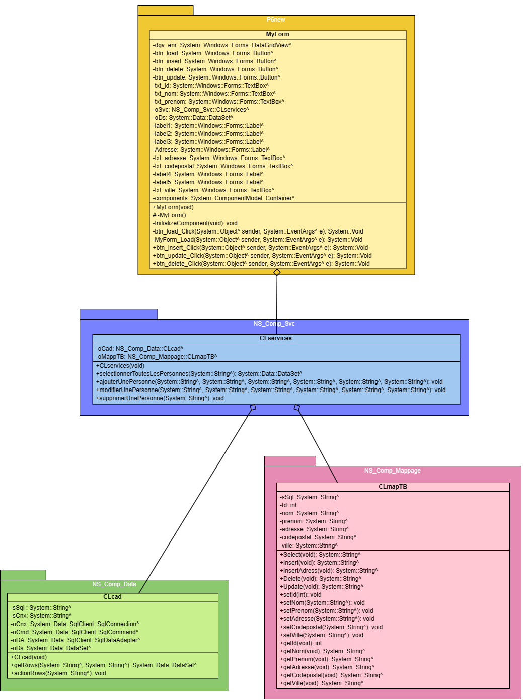
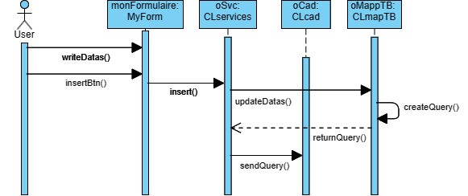
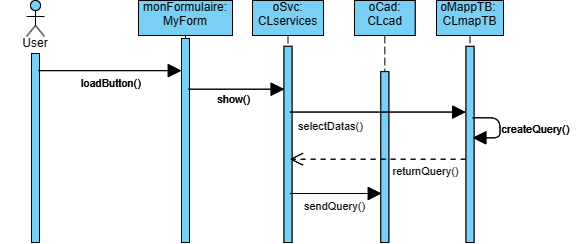
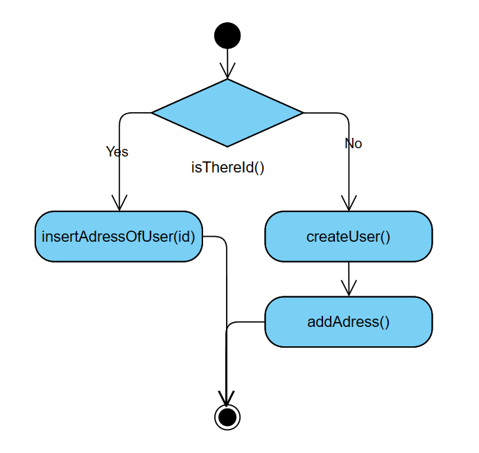
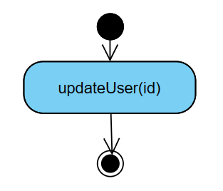
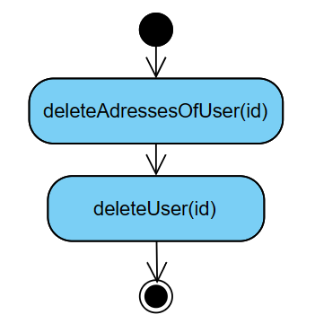
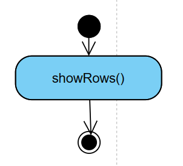

# Program of customers management
## Use case diagram

## Class diagram

## Sequence diagrams
### Insert customer

### Show customers

## Activity diagrams
### Insert click

### Update click

### Delete click

### Load click

